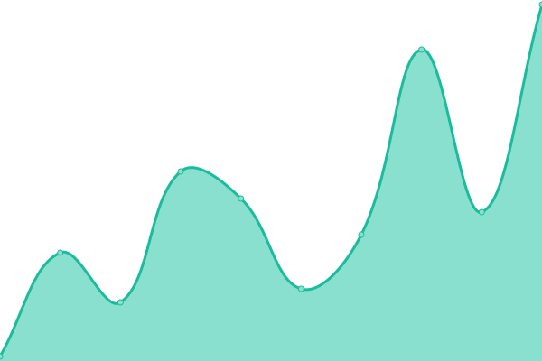

# [📈 Live Status](https://minteo-wagmi.github.io/monitoring-apps): <!--live status--> **🟩 All systems operational**

This repository contains the open-source uptime monitor and status page for [Minteo](https://minteo.com), powered by [Upptime](https://github.com/upptime/upptime).

With [Upptime](https://upptime.js.org), you can get your own unlimited and free uptime monitor and status page, powered entirely by a GitHub repository. We use [Issues](https://github.com/minteo-wagmi/monitoring-apps/issues) as incident reports, [Actions](https://github.com/minteo-wagmi/monitoring-apps/actions) as uptime monitors, and [Pages](https://minteo-wagmi.github.io/monitoring-apps) for the status page.

<!--start: status pages-->
<!-- This summary is generated by Upptime (https://github.com/upptime/upptime) -->
<!-- Do not edit this manually, your changes will be overwritten -->
<!-- prettier-ignore -->
| URL | Status | History | Response Time | Uptime |
| --- | ------ | ------- | ------------- | ------ |
|  [API](https://api.minteo.finance/v1/health) | 🟩 Up | [api.yml](https://github.com/minteo-wagmi/monitoring-apps/commits/HEAD/history/api.yml) | 

 303ms
     
 | 

<a href="https://minteo-wagmi.github.io/monitoring-apps/history/api">100.00%</a>
    

|  [Board](https://board.minteo.com/api/health) | 🟩 Up | [board.yml](https://github.com/minteo-wagmi/monitoring-apps/commits/HEAD/history/board.yml) | 

 230ms
     
 | 

<a href="https://minteo-wagmi.github.io/monitoring-apps/history/board">100.00%</a>
    

|  [Worker (by API)](https://api.minteo.finance/v1/health/worker) | 🟩 Up | [worker-by-api.yml](https://github.com/minteo-wagmi/monitoring-apps/commits/HEAD/history/worker-by-api.yml) | 

 40ms
     
 | 

<a href="https://minteo-wagmi.github.io/monitoring-apps/history/worker-by-api">100.00%</a>
    

<!--end: status pages-->

[**Visit our status website →**](https://minteo-wagmi.github.io/monitoring-apps)

## 📄 License

- Powered by: [Upptime](https://github.com/upptime/upptime)
- Code: [MIT](./LICENSE) © [Anand Chowdhary](https://anandchowdhary.com), supported by [Pabio](https://pabio.com)
- Data in the `./history` directory: [Open Database License](https://opendatacommons.org/licenses/odbl/1-0/)
